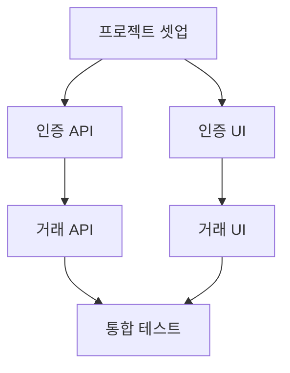

# TASKS.md 의존성 파서

> TASKS.md 파일에서 태스크 목록과 의존성 관계를 추출하는 규칙

---

## 파일 위치

```bash
# 우선순위 순서로 검색
1. docs/planning/06-tasks.md
2. docs/planning/TASKS.md
3. TASKS.md (프로젝트 루트)
```

---

## 파싱 대상 3가지

### 1. Mermaid 다이어그램 (의존성 그래프)

**위치:** ```` ```mermaid ```` 블록 내부

**형식:**


**파싱 규칙:**
```
A --> B  →  B는 A에 의존
            dependencies[B].append(A)

예시:
T0.1 --> T1.1  →  dependencies["T1.1"] = ["T0.1"]
T1.1 --> T2.1  →  dependencies["T2.1"] = ["T1.1"]
T2.1 --> T3.1  →  dependencies["T3.1"] = ["T2.1", "T2.2"]
T2.2 --> T3.1
```

**정규식 패턴:**
```regex
(T\d+\.\d+)(?:\[.*?\])?\s*-->\s*(T\d+\.\d+)
```

---

### 2. 마크다운 태스크 섹션

**위치:** `### [ ] Phase X, TX.Y: ...` 형식의 섹션

**형식:**
```markdown
### [ ] Phase 1, T1.1: 거래 내역 API 구현 RED→GREEN

**담당**: backend-specialist
**의존성**: T0.5.2 (테스트 완료 후)

**TDD 사이클**:
...
```

**파싱 규칙:**

| 필드 | 정규식 | 추출 값 |
|------|--------|---------|
| 태스크 ID | `Phase (\d+), (T\d+\.\d+)` | phase=1, task_id="T1.1" |
| 담당자 | `\*\*담당\*\*:\s*(.+)` | "backend-specialist" |
| 의존성 | `\*\*의존성\*\*:\s*(T\d+\.\d+)` | "T0.5.2" |
| 상태 | `### \[( |x|X)\]` | " "=미완료, "x"=완료 |

**예시:**
```
입력: ### [ ] Phase 1, T1.1: 거래 내역 API 구현
출력: {
  task_id: "T1.1",
  phase: 1,
  title: "거래 내역 API 구현",
  status: "pending",
  assignee: "backend-specialist",
  dependencies: ["T0.5.2"]
}
```

---

### 3. Phase 번호 (암묵적 의존성)

**규칙:**
```
Phase 0 태스크 → 의존성 없음 (즉시 실행 가능)
Phase 1 태스크 → Phase 0의 모든 태스크 완료 필요
Phase 2 태스크 → Phase 1의 모든 태스크 완료 필요
...
Phase N 태스크 → Phase N-1의 모든 태스크 완료 필요
```

**예외:**
- 같은 Phase 내에서 명시적 의존성이 있으면 그것을 우선
- Mermaid에서 정의된 의존성이 Phase 규칙보다 우선

---

## 의존성 그래프 구축

### 데이터 구조

```python
# 태스크 정보
tasks = {
    "T0.5.1": {
        "phase": 0,
        "title": "계약 정의",
        "assignee": "test-specialist",
        "dependencies": [],
        "status": "pending"
    },
    "T1.1": {
        "phase": 1,
        "title": "백엔드 API",
        "assignee": "backend-specialist",
        "dependencies": ["T0.5.2"],
        "status": "pending"
    }
}

# 의존성 그래프
dependencies = {
    "T0.5.1": [],
    "T0.5.2": ["T0.5.1"],
    "T1.1": ["T0.5.2"],
    "T1.2": ["T0.5.2"],
    "T1.3": ["T1.1", "T1.2"]
}
```

### 실행 순서 결정 알고리즘

```python
def get_execution_order(tasks, dependencies):
    """
    위상 정렬(Topological Sort)로 실행 순서 결정
    """
    completed = set()
    rounds = []

    while len(completed) < len(tasks):
        # 현재 실행 가능한 태스크 찾기
        ready = []
        for task_id, deps in dependencies.items():
            if task_id not in completed:
                if all(d in completed for d in deps):
                    ready.append(task_id)

        if not ready:
            # 순환 의존성 또는 오류
            break

        # 같은 Round에 있는 태스크는 병렬 실행 가능
        rounds.append(ready)
        completed.update(ready)

    return rounds
```

**예시 출력:**
```
rounds = [
    ["T0.5.1"],           # Round 1: 직렬
    ["T0.5.2"],           # Round 2: 직렬
    ["T1.1", "T1.2"],     # Round 3: 병렬!
    ["T1.3"],             # Round 4: 직렬
    ["T2.1", "T2.2"],     # Round 5: 병렬!
    ["T2.3"]              # Round 6: 직렬
]
```

---

## 병렬 실행 판단

### 규칙

1. **같은 Round의 태스크 = 병렬 실행 가능**
   - 서로 의존하지 않음
   - Task 도구 동시 호출

2. **다른 Round의 태스크 = 직렬 실행**
   - 의존성이 있음
   - 이전 Round 완료 대기

### 예시

```
Round 3: [T1.1, T1.2]

T1.1의 의존성: [T0.5.2] ← 이미 완료
T1.2의 의존성: [T0.5.2] ← 이미 완료
T1.1과 T1.2 사이: 서로 의존 없음

→ T1.1과 T1.2는 병렬 실행 가능!

Task 도구 동시 호출:
Task(subagent_type="backend-specialist", description="T1.1...")
Task(subagent_type="frontend-specialist", description="T1.2...")
```

---

## Phase 완료 감지

### 규칙

```python
def is_phase_complete(phase, completed_tasks, tasks):
    """
    해당 Phase의 모든 태스크가 완료되었는지 확인
    """
    phase_tasks = [t for t, info in tasks.items() if info["phase"] == phase]
    return all(t in completed_tasks for t in phase_tasks)
```

### Phase 완료 시 행동

```
1. Phase N의 모든 태스크 완료 감지
2. 테스트 실행 (pytest, npm test)
3. 빌드 확인 (npm run build)
4. main 병합 (git merge)
5. Worktree 정리
6. Phase N+1 시작
```

---

## 실패 처리

### 태스크 실패 시

```python
def handle_task_failure(task_id, error, retry_count, failed_tasks):
    """
    태스크 실패 시 처리
    """
    if retry_count >= 10:
        # 최대 시도 초과
        failed_tasks.append({
            "task_id": task_id,
            "error": error,
            "retries": retry_count,
            "reason": "MAX_RETRIES_EXCEEDED"
        })
        return "skip"

    if is_same_error(error, last_error) and same_error_count >= 3:
        # 동일 에러 3회 연속
        failed_tasks.append({
            "task_id": task_id,
            "error": error,
            "retries": retry_count,
            "reason": "SAME_ERROR_3_TIMES"
        })
        return "skip"

    return "retry"
```

### 의존 태스크 처리

```
T1.1 실패 → T1.1에 의존하는 T1.3도 실행 불가
→ T1.3을 "blocked" 상태로 표시
→ 최종 보고에서 "blocked" 태스크 목록 표시
```

---

## 출력 형식

### 파싱 결과

```json
{
  "tasks": {
    "T0.5.1": {"phase": 0, "title": "계약 정의", "assignee": "test-specialist", "dependencies": []},
    "T0.5.2": {"phase": 0, "title": "테스트 작성", "assignee": "test-specialist", "dependencies": ["T0.5.1"]},
    "T1.1": {"phase": 1, "title": "백엔드 API", "assignee": "backend-specialist", "dependencies": ["T0.5.2"]},
    "T1.2": {"phase": 1, "title": "프론트엔드 UI", "assignee": "frontend-specialist", "dependencies": ["T0.5.2"]},
    "T1.3": {"phase": 1, "title": "통합 테스트", "assignee": "test-specialist", "dependencies": ["T1.1", "T1.2"]}
  },
  "execution_order": [
    {"round": 1, "tasks": ["T0.5.1"], "parallel": false},
    {"round": 2, "tasks": ["T0.5.2"], "parallel": false},
    {"round": 3, "tasks": ["T1.1", "T1.2"], "parallel": true},
    {"round": 4, "tasks": ["T1.3"], "parallel": false}
  ],
  "phases": [0, 1],
  "total_tasks": 5
}
```

---

## 검증

### 파싱 전 확인

```bash
# TASKS.md 존재 확인
[ -f "docs/planning/06-tasks.md" ] || [ -f "docs/planning/TASKS.md" ]

# Mermaid 블록 존재 확인
grep -q "```mermaid" "$TASKS_FILE"

# 태스크 섹션 존재 확인
grep -q "### \[ \] Phase" "$TASKS_FILE"
```

### 파싱 후 검증

```
1. 순환 의존성 체크 (A→B→C→A 같은 경우)
2. 존재하지 않는 태스크 참조 체크
3. Phase 번호 연속성 체크 (0, 1, 2... 순서)
4. 담당자 유효성 체크 (backend/frontend/database/test-specialist)
```
