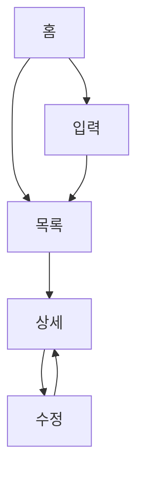

# 화면 명세 (06-screens.md) 템플릿

> 소크라테스 Phase 2 완료 후 생성되는 문서입니다.
> /screen-spec 스킬의 입력으로 사용됩니다.

---

## 개요

| 항목 | 내용 |
|------|------|
| **서비스명** | {{서비스명}} |
| **핵심 기능** | {{FEAT-1}}, {{FEAT-2}}, {{FEAT-3}} |
| **총 화면 수** | {{N}}개 |
| **인증 필요 화면** | {{M}}개 |

---

## 화면 목록

### 1. {{화면명}} ({{route}})

| 항목 | 내용 |
|------|------|
| **화면 ID** | S-01 |
| **연결 기능** | {{FEAT-X}} |
| **인증 필요** | Yes / No |
| **진입점** | {{어디서 어떻게}} |

**주요 요소:**
- {{요소1}}: {{설명}}
- {{요소2}}: {{설명}}
- {{요소3}}: {{설명}}

**사용자 액션:**
- {{액션1}} → {{결과/이동}}
- {{액션2}} → {{결과/이동}}

**이동 가능 화면:**
- → {{화면A}} ({{조건}})
- → {{화면B}} ({{조건}})

---

### 2. {{화면명}} ({{route}})

| 항목 | 내용 |
|------|------|
| **화면 ID** | S-02 |
| **연결 기능** | {{FEAT-X}} |
| **인증 필요** | Yes / No |
| **진입점** | {{어디서 어떻게}} |

**주요 요소:**
- {{요소1}}: {{설명}}

**사용자 액션:**
- {{액션1}} → {{결과/이동}}

**이동 가능 화면:**
- → {{화면A}}

---

## 화면 흐름도



---

## 화면 연결 매트릭스

| From \ To | 홈 | 목록 | 입력 | 상세 | 수정 |
|-----------|-----|------|------|------|------|
| **홈**    | -   | ✓    | ✓    |      |      |
| **목록**  | ✓   | -    |      | ✓    |      |
| **입력**  |     | ✓    | -    |      |      |
| **상세**  |     | ✓    |      | -    | ✓    |
| **수정**  |     |      |      | ✓    | -    |

---

## 공통 요소

### 헤더 (Header)
- 로고/서비스명
- 검색 (조건부)
- 사용자 메뉴
- 알림 아이콘

### 하단 네비게이션 (Bottom Nav) - 모바일
- 홈
- {{주요메뉴1}}
- {{주요메뉴2}}
- 마이페이지

### 사이드바 (Sidebar) - 데스크톱
- 메인 메뉴 목록
- 설정
- 로그아웃

---

## 인증 흐름

| 화면 | 비로그인 시 |
|------|------------|
| 홈 | 접근 가능, 일부 기능 제한 |
| 입력 | 로그인 모달 표시 |
| 목록 | 접근 가능 (본인 것만) |
| 마이페이지 | 로그인 페이지로 리다이렉트 |

---

## 빈 상태 (Empty States)

| 화면 | 빈 상태 메시지 | CTA |
|------|---------------|-----|
| 목록 | "아직 데이터가 없습니다" | "첫 번째 {{항목}} 추가하기" |
| 검색결과 | "검색 결과가 없습니다" | "다른 키워드로 검색하기" |
| 알림 | "새로운 알림이 없습니다" | - |

---

## 에러 상태

| 에러 유형 | 표시 방식 | 사용자 액션 |
|----------|----------|------------|
| 네트워크 오류 | 토스트 + 재시도 버튼 | 재시도 |
| 입력 오류 | 필드 아래 에러 메시지 | 수정 |
| 권한 오류 | 모달 | 로그인 / 돌아가기 |
| 서버 오류 | 전체 화면 에러 | 홈으로 / 재시도 |

---

## 반응형 브레이크포인트

| 디바이스 | 너비 | 주요 변화 |
|----------|------|----------|
| 모바일 | < 768px | 하단 네비게이션, 1열 레이아웃 |
| 태블릿 | 768px ~ 1024px | 2열 그리드, 축소된 사이드바 |
| 데스크톱 | > 1024px | 사이드바 + 메인, 3~4열 그리드 |

---

## 다음 단계

이 문서를 기반으로:

1. **`/screen-spec`** 실행 → 각 화면별 상세 YAML 명세 생성
2. **`/tasks-generator`** 실행 → 화면 단위 태스크 생성

```
06-screens.md (이 문서)
    ↓
/screen-spec
    ↓
specs/screens/*.yaml
    ↓
/tasks-generator
    ↓
TASKS.md
```
