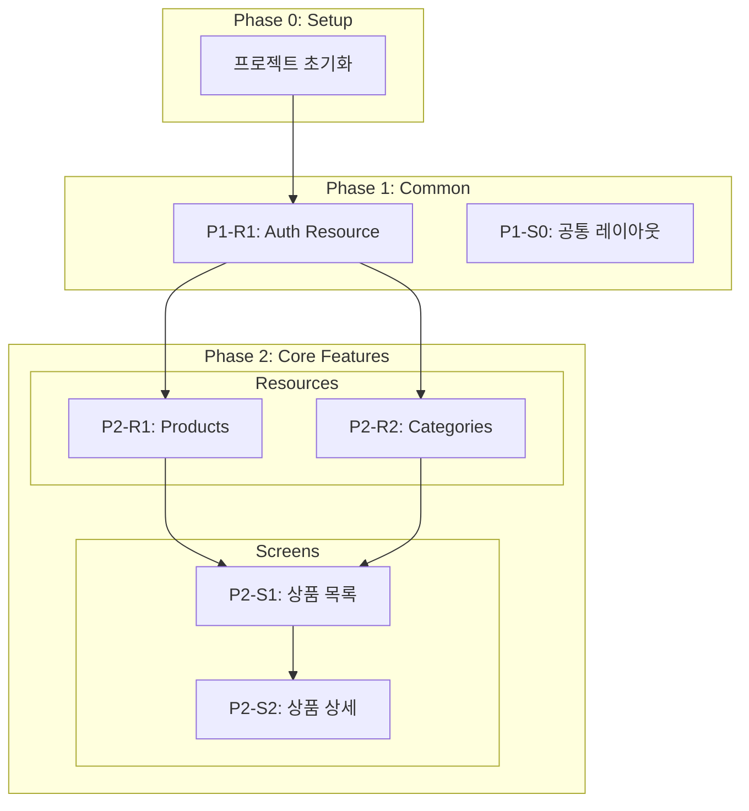

# Tasks-Generator Phase 상세 가이드

> SKILL.md에서 분리된 Phase별 상세 내용입니다.

---

## Domain-Guarded 모드 상세

### Phase 0: Domain Resources 확인

```
specs/domain/resources.yaml 읽기
    ↓
리소스 목록 추출:
- products: endpoints, fields
- categories: endpoints, fields
- wishlist: endpoints, fields
```

### Phase 1: Screen 명세 + data_requirements 추출

```
specs/screens/*.yaml 읽기
    ↓
각 화면의 data_requirements 추출:
- product-list.yaml: products, categories, wishlist
- product-detail.yaml: products, reviews
```

### Phase 2: Interface Contract Validation (핵심!)

> **중요**: 검증 실패 시 태스크 생성 중단!

**검증 실패 예시:**

```
┌─────────────────────────────────────────────────────────────┐
│  Interface Contract Validation                               │
├─────────────────────────────────────────────────────────────┤
│                                                              │
│  [product-list.yaml]                                         │
│  data_requirements:                                          │
│    - resource: products                                      │
│      needs: [id, name, price, thumbnail]                    │
│                                                              │
│  [resources.yaml]                                            │
│  products:                                                   │
│    fields:                                                   │
│      id: { type: uuid }         ✅                          │
│      name: { type: string }     ✅                          │
│      price: { type: number }    ✅                          │
│      thumbnail: ???             ❌ NOT FOUND                │
│                                                              │
│  ❌ Contract Violation: products.thumbnail 미정의           │
│                                                              │
│  → 리소스 정의 업데이트 필요!                                  │
│  → 태스크 생성 중단                                           │
│                                                              │
└─────────────────────────────────────────────────────────────┘
```

**검증 통과 시:**

```
┌─────────────────────────────────────────────────────────────┐
│  ✅ Interface Contract Validation PASSED                     │
├─────────────────────────────────────────────────────────────┤
│                                                              │
│  Coverage Matrix:                                            │
│                                                              │
│  Resource     │ Fields   │ Screens Using                     │
│  ─────────────┼──────────┼────────────────────               │
│  products     │ 5/5 ✅   │ product-list, product-detail     │
│  categories   │ 4/4 ✅   │ product-list                      │
│  wishlist     │ 2/2 ✅   │ product-list                      │
│                                                              │
│  → 태스크 생성 진행                                           │
│                                                              │
└─────────────────────────────────────────────────────────────┘
```

---

## 태스크 생성 예시

### Phase 3: Backend Resource 태스크

```markdown
## P2-R1: Products Resource

### [ ] P2-R1-T1: Products API 구현
- **담당**: backend-specialist
- **리소스**: products
- **엔드포인트**:
  - GET /api/products (목록)
  - GET /api/products/:id (상세)
  - POST /api/products (생성)
- **필드**: id, name, price, description, thumbnail, category_id
- **파일**: `tests/api/test_products.py` → `app/routes/products.py`
- **Worktree**: `worktree/phase-2-resources`
- **TDD**: RED → GREEN → REFACTOR
- **헌법**: `constitutions/fastapi/api-design.md` 준수
```

### Phase 4: Frontend Screen 태스크

```markdown
## P2-S1: 상품 목록 화면

### [ ] P2-S1-T1: 상품 목록 UI 구현
- **담당**: frontend-specialist
- **화면**: /products
- **컴포넌트**:
  - CategorySidebar (navigation)
  - ProductGrid (grid)
  - ProductCard (card)
- **데이터 요구**: products, categories (data_requirements 참조)
- **파일**: `tests/pages/ProductList.test.tsx` → `src/pages/products/index.tsx`
- **Worktree**: `worktree/phase-2-products`
- **TDD**: RED → GREEN → REFACTOR
- **데모**: `/demo/phase-2/s1-product-list`
```

### Phase 5: Verification 태스크

```markdown
### [ ] P2-S1-V: 연결점 검증
- **담당**: test-specialist
- **화면**: /products
- **검증 항목**:
  - [ ] Field Coverage: products.[id,name,price,thumbnail] 존재
  - [ ] Endpoint: GET /api/products 존재
  - [ ] Endpoint: GET /api/categories 존재
  - [ ] Navigation: ProductCard → /products/:id 라우트 존재
  - [ ] Auth: wishlist 리소스 인증 체크
```

---

## Task ID 형식

| 형식 | 용도 | 예시 |
|------|------|------|
| `P{N}-R{M}-T{X}` | Backend Resource | P2-R1-T1: Products API |
| `P{N}-S{M}-T{X}` | Frontend Screen | P2-S1-T1: Product List UI |
| `P{N}-S{M}-V` | Screen Verification | P2-S1-V: 연결점 검증 |

---

## 의존성 구조 (Mermaid)



---

## 병렬 실행 규칙

| 태스크 유형 | 병렬 가능 | 조건 |
|------------|----------|------|
| Resource 태스크간 | ✅ | 서로 의존하지 않으면 |
| Screen 태스크 | ❌ | Resource 완료 후 |
| 같은 Screen의 UI/Test | ❌ | UI 완료 후 Test |
| Verification | ❌ | 모든 관련 태스크 완료 후 |
