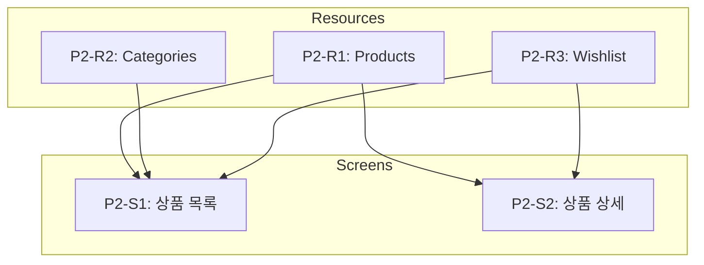

# 화면 단위 태스크 생성 규칙 v2.0

> "화면이 주도하되, 도메인이 방어한다"
> Resource 태스크와 Screen 태스크 분리, data_requirements 기반 변환

---

## 핵심 원칙

### v2.0 변경 사항

| 영역 | v1.0 | v2.0 |
|------|------|------|
| **Task 구조** | 화면 결합 (P2-S1-T1: Backend) | **분리** (P2-R1: Resource, P2-S1: Screen) |
| **API 참조** | `api.endpoint` 직접 명세 | **`data_requirements.resource`** 참조 |
| **검증** | 연결점만 | **Field Coverage + 연결점** |

### 왜 분리하는가?

```
기존 (v1.0): 백엔드가 화면에 종속
P2-S1-T1: 상품 목록 백엔드  ← 화면별로 API 정의
P2-S1-T2: 상품 목록 UI

문제점:
- 같은 products API가 여러 화면에서 중복 정의
- 화면이 바뀌면 API도 바뀜
- 재사용 어려움
```

```
개선 (v2.0): 리소스 독립
P2-R1-T1: Products API    ← 리소스 단위로 한 번 정의
P2-S1-T1: 상품 목록 UI    ← 화면은 리소스 참조만

장점:
- API가 화면과 독립
- 여러 화면에서 같은 리소스 재사용
- 백엔드 변경 최소화
```

---

## 태스크 ID 규칙

### 화면 단위 ID 형식

```
P{Phase}-R{Resource}-T{Task}: {Resource 이름} API     # Backend
P{Phase}-S{Screen}-T{Task}: {화면 이름} UI           # Frontend
P{Phase}-S{Screen}-V: 연결점 검증                    # Verification
```

| 예시 | 설명 |
|------|------|
| `P2-R1-T1` | Phase 2, Resource 1, Backend 태스크 |
| `P2-S1-T1` | Phase 2, Screen 1, Frontend 태스크 |
| `P2-S1-T2` | Phase 2, Screen 1, 통합 테스트 태스크 |
| `P2-S1-V` | Phase 2, Screen 1, 연결점 검증 |

### Phase 할당 규칙

| 유형 | Phase | 예시 |
|------|-------|------|
| 프로젝트 셋업 | P0 | P0-T0.1 |
| 공통 리소스 (Auth, Users) | P1 | P1-R1: Auth Resource |
| 공통 레이아웃 (Header, Footer) | P1 | P1-S0: 공통 레이아웃 |
| 핵심 기능 리소스 | P2+ | P2-R1: Products Resource |
| 핵심 기능 화면 | P2+ | P2-S1: 상품 목록 화면 |
| 부가 기능 | P3+ | P3-R1, P3-S1 |

---

## 화면 → 태스크 변환

### 입력: 화면 명세 YAML (v2.0)

```yaml
# specs/screens/product-list.yaml
version: "2.0"

screen:
  name: 상품 목록
  route: /products
  layout: sidebar-main

data_requirements:            # v2.0: API 대신 리소스 참조
  - resource: products
    needs: [id, name, price, thumbnail]
    filters: { category: "?category", page: "?page" }

  - resource: categories
    needs: [id, name, slug, product_count]

components:
  - id: category_sidebar
    type: navigation
    position: sidebar
    function: 카테고리 필터링
    data_source:
      resource: categories    # v2.0: API 대신 리소스 참조

  - id: product_grid
    type: grid
    position: main
    function: 상품 그리드 표시
    data_source:
      resource: products

tests:
  - name: 초기 로드
    when: 페이지 접속
    then: [상품 12개 표시, 카테고리 사이드바 표시]

connections:
  navigations:
    - from: product_card
      to: /products/:id
```

### 출력: 태스크 그룹 (분리된 구조)

```markdown
# Phase 2: 핵심 기능

## Resource 태스크 (백엔드 독립)

### P2-R1: Products Resource

#### [ ] P2-R1-T1: Products API 구현
- **담당**: backend-specialist
- **리소스**: products
- **엔드포인트**:
  - GET /api/products (목록)
  - GET /api/products/:id (상세)
- **필드**: id, name, price, thumbnail, description, category_id
- **파일**: `tests/api/test_products.py` → `app/routes/products.py`
- **스펙**: 상품 CRUD API
- **Worktree**: `worktree/phase-2-resources`
- **TDD**: RED → GREEN → REFACTOR
- **헌법**: `constitutions/fastapi/api-design.md` 준수
- **병렬**: P2-R2-T1과 병렬 가능

### P2-R2: Categories Resource

#### [ ] P2-R2-T1: Categories API 구현
- **담당**: backend-specialist
- **리소스**: categories
- **엔드포인트**:
  - GET /api/categories (목록)
- **필드**: id, name, slug, product_count
- **파일**: `tests/api/test_categories.py` → `app/routes/categories.py`
- **스펙**: 카테고리 목록 API
- **Worktree**: `worktree/phase-2-resources`
- **TDD**: RED → GREEN → REFACTOR
- **헌법**: `constitutions/fastapi/api-design.md` 준수
- **병렬**: P2-R1-T1과 병렬 가능

---

## Screen 태스크 (프론트엔드)

### P2-S1: 상품 목록 화면

> 화면: /products
> 데이터 요구: products, categories

#### [ ] P2-S1-T1: 상품 목록 UI 구현
- **담당**: frontend-specialist
- **화면**: /products
- **컴포넌트**:
  - CategorySidebar (navigation)
  - ProductGrid (grid)
  - ProductCard (card)
- **데이터 요구**: products, categories (data_requirements 참조)
- **디자인 레퍼런스**: ⭐ NEW (Stitch 연동 시 자동 추가)
  - 목업: `design/screens/product-list.png`
  - HTML: `design/html/product-list.html`
  - Stitch: `https://stitch.withgoogle.com/p/xxx/s/yyy`
- **파일**: `tests/pages/ProductList.test.tsx` → `src/pages/products/index.tsx`
- **스펙**: 카테고리 사이드바, 상품 그리드, 무한 스크롤
- **Worktree**: `worktree/phase-2-products`
- **TDD**: RED → GREEN → REFACTOR
- **데모**: `/demo/phase-2/s1-product-list`
- **데모 상태**: loading, error, empty, normal
- **의존**: P2-R1-T1, P2-R2-T1

#### [ ] P2-S1-T2: 상품 목록 통합 테스트
- **담당**: test-specialist
- **화면**: /products
- **시나리오**:
  | 이름 | When | Then |
  |------|------|------|
  | 초기 로드 | 페이지 접속 | 상품 12개 표시 |
  | 카테고리 필터 | 카테고리 클릭 | 필터링된 상품 표시 |
- **파일**: `tests/e2e/product-list.spec.ts`
- **Worktree**: `worktree/phase-2-products`

#### [ ] P2-S1-V: 연결점 검증
- **담당**: test-specialist
- **화면**: /products
- **검증 항목**:
  - [ ] Field Coverage: products.[id,name,price,thumbnail] 존재
  - [ ] Field Coverage: categories.[id,name,slug] 존재
  - [ ] Endpoint: GET /api/products 응답 정상
  - [ ] Endpoint: GET /api/categories 응답 정상
  - [ ] Navigation: ProductCard → /products/:id 라우트 존재
- **파일**: `tests/integration/product-list.verify.ts`
```

---

## data_requirements 변환 규칙

### 1. Resource 추출

```yaml
# 화면 명세
data_requirements:
  - resource: products
    needs: [id, name, price, thumbnail]
  - resource: categories
    needs: [id, name, slug]
```

↓ 변환 ↓

```
추출된 리소스:
1. products (needs: id, name, price, thumbnail)
2. categories (needs: id, name, slug)

→ P2-R1: Products Resource
→ P2-R2: Categories Resource
```

### 2. 중복 리소스 처리

여러 화면에서 같은 리소스를 참조하면 **한 번만** Resource 태스크 생성:

```
product-list.yaml: products, categories
product-detail.yaml: products, reviews

→ P2-R1: Products Resource (한 번만!)
→ P2-R2: Categories Resource
→ P2-R3: Reviews Resource
```

### 3. Auth 리소스 처리

`auth_required: true`인 리소스는 별도 표시:

```yaml
data_requirements:
  - resource: wishlist
    needs: [product_id]
    auth_required: true
```

↓ 변환 ↓

```markdown
### P2-R3: Wishlist Resource

#### [ ] P2-R3-T1: Wishlist API 구현
- **담당**: backend-specialist
- **리소스**: wishlist
- **인증**: 필수 (auth_required: true)
- **엔드포인트**:
  - GET /api/wishlist (인증 필요)
  - POST /api/wishlist (인증 필요)
  - DELETE /api/wishlist/:id (인증 필요)
```

---

## 의존성 구조

### Resource → Screen 의존성



### 실행 순서

```
1. Resource 태스크 병렬 실행
   P2-R1-T1 (Products) ←─┐
   P2-R2-T1 (Categories) ├── 병렬!
   P2-R3-T1 (Wishlist) ←─┘

2. Screen 태스크 순차 실행
   P2-S1-T1 (상품 목록 UI)
   P2-S1-T2 (통합 테스트)
   P2-S1-V (연결점 검증)

3. 다음 화면
   P2-S2-T1 (상품 상세 UI)
   ...
```

---

## 병렬 실행 규칙

| 태스크 유형 | 병렬 가능 | 조건 |
|------------|----------|------|
| Resource 간 | ✅ | 서로 의존하지 않으면 |
| Screen 간 | ✅ (주의) | 다른 화면이면 가능 |
| 같은 화면 T1, T2 | ❌ | UI 완료 후 Test |
| Verification | ❌ | 모든 관련 태스크 완료 후 |

---

## 검증 항목 자동 추출

### data_requirements → Field Coverage

```yaml
data_requirements:
  - resource: products
    needs: [id, name, price, thumbnail]
```

↓ 변환 ↓

```markdown
- [ ] Field Coverage: products.[id,name,price,thumbnail] 존재
```

### connections → Navigation 검증

```yaml
connections:
  navigations:
    - from: product_card
      to: /products/:id
```

↓ 변환 ↓

```markdown
- [ ] Navigation: product_card → /products/:id 라우트 존재
```

### auth_required → Auth 검증

```yaml
data_requirements:
  - resource: wishlist
    auth_required: true
```

↓ 변환 ↓

```markdown
- [ ] Auth: wishlist API 인증 체크
```

---

## 생성 전 체크리스트

```
+---------------------------------------------------------------------+
|  화면 단위 태스크 생성 전 체크 (7항목)                                  |
+---------------------------------------------------------------------+
|                                                                     |
|  [ ] 1. 모든 화면의 data_requirements에서 리소스가 추출되었는가?        |
|         - resource → P{N}-R{M} 태스크                                |
|                                                                     |
|  [ ] 2. Resource 태스크와 Screen 태스크가 분리되었는가?                |
|         - P{N}-R{M}-T{X}: Backend Resource                          |
|         - P{N}-S{M}-T{X}: Frontend Screen                           |
|                                                                     |
|  [ ] 3. 중복 리소스가 한 번만 생성되었는가?                             |
|         - 여러 화면에서 참조해도 Resource 태스크는 하나               |
|                                                                     |
|  [ ] 4. auth_required 리소스에 인증 표시가 있는가?                    |
|         - 인증: 필수 (auth_required: true)                          |
|                                                                     |
|  [ ] 5. Screen 태스크에 데이터 요구 참조가 있는가?                     |
|         - 데이터 요구: products, categories (data_requirements)      |
|                                                                     |
|  [ ] 6. 연결점 검증에 Field Coverage가 포함되었는가?                   |
|         - products.[id,name,price,thumbnail] 존재                   |
|                                                                     |
|  [ ] 7. Resource → Screen 의존성 그래프가 있는가?                     |
|         - Mermaid 플로우차트                                         |
|                                                                     |
+---------------------------------------------------------------------+
```

---

---

## design_reference 처리 ⭐ NEW

화면 명세 YAML에 `design_reference`가 있으면 Frontend 태스크에 자동 포함됩니다.

### YAML 입력

```yaml
# specs/screens/product-list.yaml
design_reference:
  stitch_project_id: "proj_abc123"
  screen_id: "screen_xyz789"
  image: "design/screens/product-list.png"
  html: "design/html/product-list.html"
  stitch_url: "https://stitch.withgoogle.com/p/proj_abc123/s/screen_xyz789"
  accessibility_score: 92
```

### 태스크 출력

```markdown
#### [ ] P2-S1-T1: 상품 목록 UI 구현
- **담당**: frontend-specialist
- **화면**: /products
- **디자인 레퍼런스**:
  - 목업: `design/screens/product-list.png`
  - HTML: `design/html/product-list.html`
  - Stitch: [직접 편집](https://stitch.withgoogle.com/p/proj_abc123/s/screen_xyz789)
  - 접근성 점수: 92/100
- **구현 기준**:
  - [ ] 목업 이미지와 레이아웃 일치
  - [ ] 디자인 토큰 사용 (색상, 간격, 타이포)
  - [ ] 접근성 점수 85점 이상 유지
```

### 디자인 토큰 참조

`specs/design-tokens.yaml`이 있으면 자동 참조:

```markdown
- **디자인 토큰**: `specs/design-tokens.yaml`
  - colors: primary, surface, text-primary
  - spacing: sm, md, lg
  - typography: Pretendard
```

### Verification 태스크에 디자인 검증 추가

```markdown
#### [ ] P2-S1-V: 연결점 검증
- **담당**: test-specialist
- **검증 항목**:
  - [ ] Field Coverage: products.[id,name,price,thumbnail] 존재
  - [ ] Navigation: ProductCard → /products/:id 라우트 존재
  - [ ] Design Match: 목업 이미지와 구현 일치 (시각적 회귀 테스트) ⭐ NEW
  - [ ] Accessibility: WCAG 2.1 AA 준수 (점수 85+) ⭐ NEW
```

---

## 관련 문서

- [Tasks 문서 생성 규칙 v2.0](./tasks-rules.md)
- [Domain Resource Validation](./domain-resource-validation.md)
- [화면 명세 스키마 v2.0](../../screen-spec/references/schema.md)
- [Domain Resources 스키마](../../screen-spec/references/domain-resources-schema.md)
- [Stitch MCP 연동 가이드](../../screen-spec/references/stitch-integration.md) ⭐ NEW
